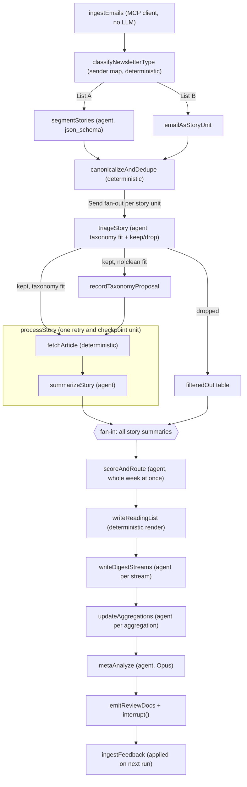

# Newsletter Agent: Phased Build Plan

Companion to [newsletter-agent-prd.md](newsletter-agent-prd.md). The PRD defines what we are building; this document defines how and in what order.

## Confirmed decisions

- TypeScript. LangGraph.js for orchestration, `@anthropic-ai/claude-agent-sdk` for each agent task.
- Gmail through a Dockerized Gmail MCP server, but called **deterministically** from a LangGraph node acting as an MCP client, so raw newsletter HTML never enters a model context.
- List A segmentation is agent-based with structured JSON output; per-newsletter deterministic parsers added only where the agent proves unreliable.
- Claude Code subscription auth (CLI at `/Users/vincenthuang/.local/bin/claude`, v2.1.221). Tiered models: Sonnet for triage, segmentation, summaries, and digests; Opus for meta-analysis; Haiku only for mechanical extraction tasks that evals prove it can handle.
- Local Postgres 17.6 for the app database. Langfuse runs as a separate self-hosted deployment outside this repo.
- Feedback via markdown review docs. Web frontend is the last phase.

## Design principles

Two rules keep this cheap and debuggable.

**Deterministic by default.** Anything that does not require judgment is plain TypeScript inside a LangGraph node: Gmail retrieval, HTML cleanup, URL canonicalization, dedupe, article fetching, database writes, git commits.

**One agent call per judgment.** Each agent task is a single `query()` with a scoped system prompt, `settingSources: []` so no ambient project settings leak in, a narrow `allowedTools`, `outputFormat: { type: 'json_schema', schema }` for a typed result, and `maxBudgetUsd` as a guard. Every result reports `total_cost_usd`, which we persist per step in `agent_calls`.

## Architecture



### Triage outcomes

Triage routes into three branches, but only two destinations: the two kept branches rejoin before processing.

- **Dropped**: written to `classifications` with a reason and confidence, rendered into the week's filter-out review doc.
- **Kept with a taxonomy fit**: proceeds straight to fetch and summarize.
- **Kept with no clean fit**: passes through `recordTaxonomyProposal` first, which writes a `proposals` row from the agent's `taxonomyGap: { proposedCategory, rationale, nearestExistingTopic }` and tags the story with a provisional topic so downstream digest writing is not blind to it. The proposal surfaces in the week's review doc for your approval. The story then rejoins the kept path and is processed identically.

### Fan-out and fan-in

The per-story branch spans triage through summarization. Everything after that operates on the whole week at once:

- `scoreAndRoute` sees all of the week's summaries in a single call. This is deliberate. Relevance and quality scores are more consistently calibrated when the model ranks stories against each other rather than judging each in isolation, and routing to digest streams and aggregations is a grouping decision that benefits from seeing the full set. Roughly 30 summaries at 400 words each is about 25k tokens, comfortably within one Sonnet call.
- `writeReadingList`, `writeDigestStreams`, `updateAggregations`, `metaAnalyze`, `emitReviewDocs`, and `ingestFeedback` all run once per run.

## Concurrency and agent granularity

**One global semaphore.** A `Send` fan-out over 60 story units would otherwise launch 60 agent calls in a single superstep, and each `query()` spawns a Claude Code CLI child process. Wrap every agent call in a shared `p-limit` semaphore in `runAgent.ts`, default concurrency 4, set by `AGENT_CONCURRENCY`. This bounds subprocesses, memory, and subscription rate limit pressure in one place rather than tuning each node.

**Merge fetch and summarize; keep triage separate.** `fetchArticle` and `summarizeStory` are logically distinct steps, but they execute inside a single `processStory` node per story: deterministic fetch, then the summarize agent call. One node means one retry unit and one resume boundary per story, while each step still gets its own `run_steps` row so failures are attributable to the fetch or the summary. Triage stays a separate earlier pass because it runs over all 60-100 story units while summarization runs only over the roughly 30 keepers; separating them is precisely what lets a wide cheap pass gate a narrow expensive one. Merging triage into summarization would be worth revisiting only if Phase 7 cost data shows re-reading List B content dominates the bill.

**Aggregate steps are sequential, except digests.** The three digest stream writers are independent of each other and can run concurrently under the same semaphore. Aggregation updates are also independent per aggregation document. Everything else in the converged tail runs in order.

## Repo layout

```
src/
  config/          senders.ts (sender -> A|B), models.ts, env.ts
  db/              schema.ts (Drizzle), migrations/, client.ts, repos/
  mcp/             gmailClient.ts (MCP stdio client over Docker)
  content/         html.ts (cheerio + turndown), canonicalUrl.ts, fetchArticle.ts
  agents/          runAgent.ts (query() wrapper + semaphore), segment.ts, triage.ts,
                   summarize.ts, score.ts, digest.ts, aggregation.ts, meta.ts
  graph/           state.ts (Annotation.Root), nodes/, graph.ts
  observability/   instrumentation.ts (OTel + Langfuse, imported first)
  cli/             run.ts, resume.ts, review.ts
artifacts/         taxonomy.md, weeks/<week>/reading-list.md, weeks/<week>/digests/,
                   aggregations/, weeks/<week>/review/
docs/              langfuse-setup.md
```

## Migrations

Schema is built up phase by phase rather than all at once. Each phase adds one numbered Drizzle migration containing only the tables that phase needs, so every migration is small enough to read and tied to code that exercises it.

- Phase 0: `runs`, `run_steps`, `agent_calls`, plus the LangGraph checkpointer tables created by `checkpointer.setup()`.
- Phase 1: `newsletters`, `emails`.
- Phase 2: `story_units`, `story_sources`.
- Phase 3: `topics`, `story_topics`, `classifications`, `proposals`.
- Phase 4: `articles`, `summaries`.
- Phase 5: `scores`, `digest_streams`, `digest_items`, `aggregations`, `aggregation_versions`.
- Phase 6: `feedback`.

## Phase 0: Foundations

- Scaffold: `pnpm`, TypeScript ESM, `tsx` for the CLI, `vitest`, `zod` for all agent schemas, `p-limit` for the semaphore.
- Drizzle + `drizzle-kit` wired up, with the Phase 0 migration only.
- `PostgresSaver.fromConnString(...)` from `@langchain/langgraph-checkpoint-postgres`, with `await checkpointer.setup()` on first run and thread id equal to the week id (for example `2026-W32`). This is what makes an interrupted run resume rather than reprocess.
- `src/agents/runAgent.ts`: wraps `query()`, takes `{ name, systemPrompt, prompt, schema, model, maxBudgetUsd, mcpServers?, allowedTools? }`, acquires the global semaphore, validates the structured result with zod, writes an `agent_calls` row with tokens, USD, and the Langfuse trace id, and returns typed output.
- Observability in this repo is only the client side: `src/observability/instrumentation.ts` starts an OTel `NodeSDK` with `LangfuseSpanProcessor` plus `ClaudeAgentSDKInstrumentation` from `@arizeai/openinference-instrumentation-claude-agent-sdk`, and a `shouldExportSpan` filter that admits that instrumentation scope. LangGraph node spans come from `CallbackHandler` in `@langfuse/langchain`, passed as `callbacks` on `graph.invoke`. Agent spans and graph spans then land in one Langfuse trace.

**Langfuse itself lives outside this repo.** Clone `langfuse/langfuse` separately and run its `docker compose up`; it brings its own Postgres, Clickhouse, Redis, and MinIO, which should not be entangled with this project's database or compose file. This repo needs only `LANGFUSE_PUBLIC_KEY`, `LANGFUSE_SECRET_KEY`, and `LANGFUSE_BASEURL` in `.env`, with the clone-and-run steps recorded in `docs/langfuse-setup.md`.

Exit check: `pnpm run db:migrate` succeeds, Langfuse is reachable at its local URL, and a hello-world agent call appears there as a trace with a cost figure.

## Phase 1: Steps 1-2, ingest and normalize

- Bring up the Gmail MCP server in Docker Desktop's MCP Toolkit. Docker Desktop was stopped when this plan was written, so first run `docker mcp catalog show` to confirm a Gmail entry; if absent, pin a read-only Gmail MCP image with `gmail.readonly` scope only and desktop OAuth credentials mounted from `~/.gmail-mcp`.
- `src/mcp/gmailClient.ts` connects with `@modelcontextprotocol/sdk` `Client` + `StdioClientTransport` running `docker mcp gateway run --servers gmail`. The same server config object is reusable as an Agent SDK `mcpServers` entry later, so nothing is discarded if a future phase wants agent-driven mailbox access.
- `ingestEmails` node: one Gmail query per sender from `config/senders.ts` scoped to the week, then fetch each message, storing raw HTML plus a cleaned markdown rendering (`cheerio` to strip tracking pixels and boilerplate, `turndown` to markdown), keyed by `gmail_message_id` so re-runs are idempotent.
- `classifyNewsletterType` node: pure lookup in the sender map, A or B, with an explicit unknown-sender path that logs for review rather than guessing.

Exit check: `pnpm run pipeline --week 2026-W32 --until ingest` stores roughly 30 emails with clean markdown, zero model tokens spent.

## Phase 2: Step 2, story unit segmentation and dedupe

- `segmentStories` agent (Sonnet): input is one List A email's markdown, output is `{ stories: [{ title, blurb, url, sectionLabel }] }` via `outputFormat` json_schema. One call per email.
- `content/canonicalUrl.ts`: follow tracker redirects (`beehiiv`, `substack`, `link.mail.*`) with capped redirects and a timeout, strip `utm_*` and similar parameters, then hash to a `dedupe_key`.
- `canonicalizeAndDedupe` node: collapse the same article appearing in TLDR, Rundown, and Superhuman into one `story_units` row with multiple `story_sources` rows, preserving each newsletter's blurb since triage benefits from all of them. List B emails become a single unit with the email as content.
- Golden-file tests: save several real emails per List A newsletter as fixtures and assert segment counts and URLs, so prompt changes are measurable rather than vibes.

Exit check: `--until segment` yields a deduped story unit list you can eyeball against the source emails.

## Phase 3: Step 3.1, triage and taxonomy

Triage is the highest-leverage decision in the pipeline: it determines what you never see. It gets the strongest model and its evaluation harness is built here rather than deferred.

- `artifacts/taxonomy.md` holds the PRD taxonomy as the source of truth, mirrored into `topics` on load, with `parent_id` for the AI Technical Area sub-categories.
- `triageStory` agent on **Sonnet with a thinking budget**, not Haiku. Input is all source blurbs for the unit (or the full List B content). Output is `{ topics: [...], keep: boolean, reason, confidence, taxonomyGap?: { proposedCategory, rationale, nearestExistingTopic } }`.
- Fan-out with `Send` from a conditional edge over story units, bounded by the global semaphore, with each unit's result reduced back into state and its `run_steps` row marked done so a resume skips it.
- Kept stories continue to Phase 4 processing whether or not they fit the taxonomy. A `taxonomyGap` writes a `proposals` row and tags the story with a provisional topic.
- Drops write to `classifications` and render into `artifacts/weeks/<week>/review/filtered-out.md`. Proposals render into `artifacts/weeks/<week>/review/proposals.md`.
- Build the triage fixture set now: 30-50 hand-labeled story units from a real week, run as a `vitest` suite and mirrored into a Langfuse dataset. This is what makes the later attempt at downgrading triage to Haiku a measurement rather than a guess.

Exit check: `--until triage` produces a filter-out doc plus topic assignments for a real week, and the triage suite reports agreement against your labels.

## Phase 4: Step 3.2, fetch and summarize

- `content/fetchArticle.ts`: `undici` fetch with a real user agent and timeout, `@mozilla/readability` + `jsdom` for extraction, stored to `articles` with a status. On failure, fall back to summarizing from blurbs and mark the summary as blurb-derived rather than silently degrading.
- `summarizeStory` agent (Sonnet): 1-6 paragraph summary sized to the story, prompted to preserve specifics such as numbers, names, and concrete claims over generic framing.
- Both live inside a single `processStory` node per story unit, so a failed fetch or a failed summary retries as one unit.

Exit check: `--until summarize` gives a week of stories with stored article blobs and summaries, plus a Langfuse cost figure for the run.

## Phase 5: Steps 3.2.4-4, score, route, and write

- `scoreAndRoute` agent (Sonnet), one call over all of the week's summaries: returns per-story `{ relevanceScore, qualityScore, confidence, recommendation: 'read-full' | 'summary-only', digestStreams: [...], aggregations: [...] }`. Low-confidence entries flag into the review docs.
- `writeReadingList` (deterministic, no agent): renders `artifacts/weeks/<week>/reading-list.md`, the single document containing every kept story for the week. Grouped by taxonomy topic and ordered by score within each group, each entry carries the title, the source newsletters it appeared in, the canonical article link, the read-full or summary-only recommendation with its scores, and the full summary text. A header gives counts and links to the filter-out and proposals docs. This is a pure render from Postgres, so it costs nothing, always matches the stored data, and can be regenerated after you revise scores during review. It is also the catch-all: the three digest streams only cover News, AI Technical Area Updates, and Tech Industry Trends, so topics like Personal Productivity or Founding and Startups would otherwise have no readable home.
- `writeDigestStreams`: one agent call per stream (News, AI Technical Area Updates, Tech Industry Trends) receiving that stream's summaries, writing `artifacts/weeks/<week>/digests/<stream>.md` with links back to sources and read-full recommendations. The three run concurrently under the semaphore.
- `updateAggregations`: for each aggregation with new items, the agent receives the current document plus the new material and returns a full replacement document. Version control is a git commit per run in `artifacts/`, with `aggregation_versions` recording the commit SHA, so diffs are reviewable with ordinary git tooling.

Exit check: a week's reading list plus three digests and updated aggregations, with a clean `git diff` you can read. At this point the pipeline is already useful on its own, since the reading list is the artifact you would actually sit down with.

## Phase 6: Steps 5-6, meta-analysis and feedback loop

- `metaAnalyze` (Opus): receives run statistics from `run_steps` and `agent_calls` (counts, drops, low-confidence items, failed fetches, cost per step) and writes `artifacts/weeks/<week>/review/meta.md` with procedural improvement suggestions.
- `emitReviewDocs` then `interrupt()`: the graph pauses with the checkpointer holding state. You annotate the review docs inline with a simple convention, for example `> verdict: keep`, `> verdict: drop`, or free-text notes.
- `pnpm run review --week 2026-W32` parses your annotations into `feedback` and resumes via `new Command({ resume: ... })`.
- `ingestFeedback` at the head of the next run turns accumulated feedback into few-shot examples appended to the triage and scoring prompts, and applies accepted taxonomy proposals to `artifacts/taxonomy.md`.

Exit check: a full step 1-6 run for one week, interruptible and resumable at any point.

## Phase 7: Evals and cost

- Extend the Phase 3 triage dataset into Langfuse datasets covering scoring and routing, built from your accumulated feedback verdicts, and score prompt revisions against them.
- Revisit model tiering with real data: test whether Haiku matches Sonnet on triage against the labeled set, and measure whether merging triage into summarization for List B would actually save money.
- Cost report per run and per step from `agent_calls`, surfaced in the meta doc.

## Phase 8: Web frontend (deferred)

Local Next.js reader over the same Postgres: articles, summaries, artifacts with text-to-speech, a simplified run timeline linking into Langfuse, and feedback widgets replacing the markdown annotation flow.

## Notable risks

- The Gmail MCP catalog entry may expose only thread-level reads or lack full-body retrieval. Phase 1 verifies tool shapes before anything else is built on them.
- Newsletter HTML drifts, which is why Phase 2 keeps fixtures and golden tests from the start.
- Some article fetches will fail on paywalls and JS-heavy pages. The blurb-derived fallback is explicit and visible in review rather than hidden.
- `scoreAndRoute` over an entire week is one large call; if a week ever produces far more keepers than expected, it needs chunking with a merge step.
