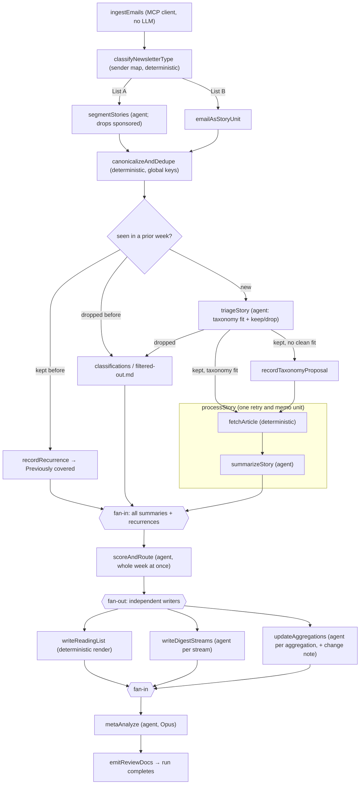

# Newsletter Agent: Phased Build Plan

Companion to [newsletter-agent-prd.md](newsletter-agent-prd.md). The PRD defines what we are building; this document defines how and in what order. Where the two disagree, **this document wins** — it reflects later decisions.

## Confirmed decisions

- TypeScript. LangGraph.js for orchestration, `@anthropic-ai/claude-agent-sdk` for each agent task.
- Gmail through a Dockerized Gmail MCP server, but called **deterministically** from a LangGraph node acting as an MCP client, so raw newsletter HTML never enters a model context.
- List A segmentation is agent-based with structured JSON output; per-newsletter deterministic parsers added only where the agent proves unreliable. Sponsored blocks are detected and excluded at segmentation.
- Claude Code subscription auth (CLI at `/Users/vincenthuang/.local/bin/claude`, v2.1.229). Model IDs are pinned explicitly in `config/models.ts`, not resolved from aliases at runtime, so an eval result stays attributable to a specific model.
- Local Postgres 17.6 for the app database. Langfuse runs as a separate self-hosted deployment outside this repo.
- **Resume is database memoization, not a graph checkpointer.** See Resume and idempotence below.
- Story identity is **global across weeks**, not per-run. See Cross-week identity below.
- **Postgres is the source of truth for every artifact, article body, and summary, and holds their version history.** Files on disk are a rendered, disposable view in a git-ignored data directory. This repo's git history contains code only. See Storage and versioning below.
- Feedback via markdown review docs, applied on the following run. The graph does not pause. Web frontend is the last phase.

## Design principles

Three rules keep this cheap and debuggable.

**Deterministic by default.** Anything that does not require judgment is plain TypeScript inside a LangGraph node: Gmail retrieval, HTML cleanup, URL canonicalization, dedupe, recurrence detection, article fetching, database writes, version diffing, and rendering artifacts to disk.

**One agent call per judgment.** Each agent task is a single `query()` with a scoped system prompt, `settingSources: []` so no ambient project settings leak in, a narrow `allowedTools`, a typed structured result validated with zod, and a budget guard. Every result's reported usage is persisted per step in `agent_calls`.

**Every nondeterministic step is memoized by key.** No agent call runs twice for the same `(run, step, unit)`. This is what makes an interrupted run resume rather than reprocess, and it is the single mechanism — there is no second one to drift out of sync with it.

## Model tiering

| Step | Model | Notes |
|---|---|---|
| `segmentStories` | `claude-sonnet-5` | Bounded extraction; golden-file tested from Phase 2 |
| `triageStory` | `claude-sonnet-5`, thinking on | Highest-leverage decision. Tier is fixed regardless of volume; Phase 3 evals decide whether it should be `claude-opus-5` |
| `summarizeStory` | `claude-sonnet-5` | |
| `scoreAndRoute` | `claude-sonnet-5` | One call over the whole week |
| `writeDigestStreams` | `claude-sonnet-5` | |
| `updateAggregations` | `claude-sonnet-5` | |
| `metaAnalyze` | `claude-opus-5` | Once per run, reasoning over run statistics |

Haiku (`claude-haiku-4-5`) is not used anywhere by default. It is a Phase 7 candidate for segmentation only, and only if the golden-file suite shows parity.

**Why Sonnet for triage.** Triage is the most consequential judgment in the pipeline, but it is also a bounded one: given a blurb or an article body, pick topics and decide keep/drop with a confidence. Sonnet 5 with thinking is close to Opus on exactly this kind of scoped judgment, and triage runs over every story unit — the largest call volume in the pipeline by a wide margin — so the tier choice dominates weekly rate-limit consumption. Phase 3 exists to turn this into a measurement rather than a preference.

## Volume assumptions

The earlier estimate of 60–100 story units per week was a guess and is probably about half the real number. Working from the PRD's newsletter list:

| Newsletter | Emails/wk | Links/issue | Raw units |
|---|---:|---:|---:|
| TLDR | 5 | ~10–12 | 50–60 |
| The Rundown AI | 5 | ~8–10 | 40–50 |
| Superhuman | 7 | ~5 | ~35 |
| Ben's Bites | 2–3 | ~10 | ~25 |
| TLDR Founders | 3 | ~8 | ~24 |

That is roughly **175–195 raw List A links**, collapsing to **120–140 unique** at 30–40% cross-newsletter overlap, plus ~15 List B units. Total emails ingested is ~37/week, not ~30.

Nothing in the architecture depends on the exact figure, but three things are sized against it: triage call volume, the Phase 1 exit check, and whether `scoreAndRoute` fits in one call. **Phase 1 replaces these estimates with counts from a real week before Phase 3 commits to a triage tier.**

## Resume and idempotence

The pipeline is a series of deterministic and nondeterministic steps. Every nondeterministic step records its outcome, keyed by the unit of work it operated on. Resuming a run re-enters the graph from the top; every step that already completed returns its stored result immediately, and only unfinished work executes.

```
run_steps (
  run_id, step_name, unit_key,
  status,          -- pending | running | done | failed
  result,          -- jsonb; the validated agent output
  error, started_at, finished_at, attempt,
  UNIQUE (run_id, step_name, unit_key)
)
```

`unit_key` is the Gmail message id for per-email steps, the story unit's dedupe key for per-story steps, the stream or aggregation name for those, and `''` for run-level steps. Every agent call goes through one helper:

```ts
withStep(runId, stepName, unitKey, async () => { ... })
```

which returns the stored `result` if a `done` row exists, and otherwise executes, validates, and records. Deterministic steps do not need it — they are idempotent by construction (`gmail_message_id` upserts, canonical URL hashing, pure renders from Postgres).

**Why not the LangGraph Postgres checkpointer.** Checkpoints are written at superstep boundaries. A `Send` fan-out over ~150 story units is a single superstep, so its natural granularity is "all triage done" or "none." Per-task pending writes can give finer resolution, but the behavior is subtle and version-dependent, and its failure mode — silently re-running 150 agent calls on resume — is expensive and easy to miss. Database memoization gives exactly the semantics we want at exactly the granularity we want, survives a crash at any point rather than only at boundaries, survives changes to the graph's topology between runs, and is inspectable with a `SELECT`. It is also the only mechanism, so there is nothing for it to disagree with.

Re-entering the graph from the top costs almost nothing: ingestion is a Gmail-keyed upsert, segmentation and triage hit memoized rows, and the deterministic renders re-derive from Postgres in milliseconds.

## Cross-week identity

Articles recur. A story covered by TLDR on Tuesday shows up in Latent.Space the following week; a developing story appears across two or three consecutive weeks. Story identity is therefore **global**, not per-run:

- `story_units` is keyed by `dedupe_key` (the hash of the canonicalized URL) and is **run-independent**. One row per article, forever.
- `story_sources` rows carry `run_id`, so a single story unit accumulates sources across weeks as more newsletters link it.
- List B units key on the canonical post URL where one exists, and otherwise on a hash of `(sender, subject, publish date)`.

Recurrence handling is deterministic — no model call:

| Prior state of the `dedupe_key` | This week |
|---|---|
| Not seen before | Normal path: triage → process |
| Seen, kept, summarized | **Do not re-triage, re-fetch, or re-summarize.** Record the new source; render under "Previously covered" in the reading list with a link to the original week |
| Seen, dropped | Drop again silently; log to `classifications` with `reason: 'recurrence-of-prior-drop'` and surface as a one-line note in the filter-out doc |

This is deliberately blunt for v1. If a recurrence turns out to often carry material new development that the flat rule buries, the escalation is a cheap agent call comparing the new blurb against the stored summary — but that is a Phase 7 refinement driven by observed misses, not a v1 requirement.

## Storage and versioning

**Postgres holds everything durable.** Nothing the pipeline produces depends on a file existing on disk, and this repo's git history contains code only.

| What | Where |
|---|---|
| Raw email HTML + cleaned markdown | `emails` |
| Fetched article: raw HTML **and** extracted text | `articles`, keyed to the global `story_unit` |
| Summaries | `summaries`, keyed to the global `story_unit` |
| Reading lists, digests, review docs, aggregations, taxonomy | `artifact_versions` |

Both the raw HTML and the Readability-extracted text of every fetched article are stored. Raw HTML is what lets you re-extract later when extraction fails or the extractor improves, and at ~30 articles a week it is a few megabytes a month — irrelevant to Postgres, and expensive to recover once the URL rots. Storing summaries against the *global* story unit rather than the run is what makes the "Previously covered" recurrence path work: it links to a summary written weeks ago.

**Versioning is a table, not git.** One table covers every versioned document uniformly:

```
artifact_versions (
  artifact_kind,   -- 'aggregation' | 'taxonomy' | 'digest' | 'reading-list' | 'review'
  artifact_key,    -- e.g. 'best-guides', '2026-W32/digests/news'
  version,         -- monotonic per (kind, key)
  content, content_hash, run_id, created_at,
  UNIQUE (artifact_kind, artifact_key, version)
)
```

Diffs between versions are computed in TypeScript against the prior row and rendered into the aggregation change notes, which is what the Phase 5 rewrite guard checks against. This replaces the git-commit-per-run scheme and the separate `aggregation_versions` table: one mechanism for all documents, queryable, and no commit noise in the code repo.

**Disk is a rendered view.** Everything is also written to `ARTIFACTS_DIR` (default `./data/artifacts`, git-ignored; set the env var to relocate it entirely outside the repo) so you can read the week in an editor. That directory is disposable — a `render` CLI command regenerates the whole tree from Postgres. Feedback annotations you write into review docs are the one thing flowing the other way, and `pnpm run review` parses them back into `feedback` rows; do not delete a week's review docs before running it.

## The weekly read

The artifacts are sized to a target reading budget. This is a target, not a constraint, and it will need iteration once real weeks exist.

| Artifact | Target | Implied size |
|---|---|---|
| Reading list (summaries) | ~60 min | ~30 kept stories × 1–6 paragraphs |
| Digest streams (3) | 5–10 min each | ~1,200–2,500 words each |
| Aggregation change notes | 1–5 min each | A few sentences plus the diff stats |
| Recommended full articles | remainder | Driven by the `read-full` count |

Review docs (filter-outs, proposals, meta-analysis) are not counted — that effort should decline as feedback accumulates.

The lever when this runs long is the `read-full` vs `summary-only` split from `scoreAndRoute`, not summary length: cutting summaries makes the reading list worse at its actual job, which is letting you decide what to read in full.

## Architecture



### Triage outcomes

Triage routes into three branches, but only two destinations: the two kept branches rejoin before processing.

- **Dropped**: written to `classifications` with a reason and confidence, rendered into the week's filter-out review doc.
- **Kept with a taxonomy fit**: proceeds straight to fetch and summarize.
- **Kept with no clean fit**: passes through `recordTaxonomyProposal` first, which writes a `proposals` row from the agent's `taxonomyGap: { proposedCategory, rationale, nearestExistingTopic }` and tags the story with a provisional topic so downstream digest writing is not blind to it. The proposal surfaces in the week's review doc for your approval. The story then rejoins the kept path and is processed identically.

### Triage calibration and the filter-out loop

Triage errors are not equally *visible*. A false keep costs one fetch and one summary and lands in the reading list, where you skim past it in seconds. A false drop is invisible in the moment — you cannot miss what you never saw.

The correction for that is the filter-out doc, not a thumb on the prompt. **Triage judges neutrally**; the system prompt contains no instruction to lean toward keeping. `weeks/<week>/review/filtered-out.md` lists every drop with its reason and confidence, and reviewing it is the mechanism that surfaces false drops in early runs. As feedback accumulates and the prompt sharpens, that review shrinks to a skim — and how fast it shrinks is itself a signal worth watching in the meta doc.

Two consequences:

1. The Phase 3 eval reports agreement across both classes, **broken out separately for keeps and drops**, so a model hitting its overall number lopsidedly is visible rather than averaged away.
2. Drops sort **lowest-confidence first** in the filter-out doc. That is where a review pass pays off most per minute spent.

### Fan-out and fan-in

There are three fan-out points:

- **Per story unit**, spanning triage through summarization.
- **`scoreAndRoute`** is the one deliberate bottleneck: a single call over all of the week's summaries. Relevance and quality scores calibrate more consistently when the model ranks stories against each other rather than judging each in isolation, and routing to digest streams and aggregations is a grouping decision that benefits from seeing the full set. At ~30–40 summaries of ~400 words this is 25–35k tokens — comfortably one call, with the chunk-and-merge fallback in Notable Risks if a week ever runs far hotter.
- **The converged tail**, which is wider than it first appears. `writeReadingList`, the three digest writers, and the per-aggregation writers all read from Postgres and write to disjoint rows, so they are mutually independent and **fan out together** once `scoreAndRoute` lands, under the same semaphore. Only `metaAnalyze` and `emitReviewDocs` need the full set, and they run after the tail converges.

## Concurrency, rate limits, and failure

**Set concurrency where a rate limit is unlikely, not where throughput is maximized.** This is a weekly batch job with no latency requirement. At ~150 triage calls and ~30 summaries, a concurrency of 4 finishes the whole pipeline in roughly 20–30 minutes; a concurrency of 12 might finish in 10. Nothing is gained from the second number, and it multiplies the chance of tripping a subscription rate limit mid-run.

**One global semaphore, default 4** (`AGENT_CONCURRENCY`). A `Send` fan-out over 120–150 story units would otherwise launch that many calls in a single superstep, and each `query()` spawns a Claude Code CLI child process at roughly 150–300MB RSS. Every agent call acquires the semaphore in `runAgent.ts`, so there is one knob rather than one per node.

**Per-step concurrency tuning is deliberately not in v1.** The steps do have very different token profiles — triage is a short blurb in and a short verdict out, summarize is a full article in, digest is many summaries in and a long document out — so a single number is a compromise across all three. But which one actually binds is unknowable until real weeks exist, and guessing wrong costs a slower batch job, not a broken one.

Three things matter more than the number:

**Adaptive backoff on rate limits.** A 429 at concurrency 4 produces four simultaneous failures unless something responds at the semaphore level. `runAgent.ts` treats a rate-limit response as a global signal: drop effective concurrency to 1, honor the retry delay, then ramp back to the configured value over subsequent successes. This is what makes a run degrade gracefully instead of collapsing.

**Retry, then fail the step — not the run.** Exponential backoff with jitter, a capped attempt count, and on exhaustion the `run_steps` row is marked `failed` with the error while the graph continues. The failed unit is picked up by the next resume. One unreachable article should not cost you the week.

**A runaway guard.** A hard ceiling on total agent calls per run, checked in `runAgent.ts`. If segmentation misfires and yields 2,000 story units, the run should stop and say so — not reveal it by exhausting a week of rate limit.

**Instrument rather than tune.** Each `run_steps` row records queue wait alongside execution time. After two or three real weeks that data says whether triage is throughput-bound, whether summarize is the memory pressure, and whether per-step limits are worth adding at all.

### Agent granularity

**Merge fetch and summarize; keep triage separate.** `fetchArticle` and `summarizeStory` execute inside a single `processStory` node per story: deterministic fetch, then the summarize agent call. One node means one retry unit and one memo boundary per story, while each step still gets its own `run_steps` row so failures are attributable to the fetch or the summary. Triage stays a separate earlier pass because it runs over every new story unit while summarization runs only over the keepers; separating them is precisely what lets a wide cheap pass gate a narrow expensive one.

**The tail fans out.** `writeReadingList`, the three digest writers, and the per-aggregation writers are mutually independent and run concurrently under the same semaphore. `metaAnalyze` and `emitReviewDocs` run after they converge.

## Repo layout

```
src/
  config/          senders.ts (sender -> A|B), models.ts (pinned IDs), env.ts
  db/              schema.ts (Drizzle), migrations/, client.ts, repos/
                   steps.ts (withStep memoization helper)
  mcp/             gmailClient.ts (MCP stdio client over Docker)
  content/         html.ts (cheerio + turndown), canonicalUrl.ts, fetchArticle.ts
  agents/          runAgent.ts (query() wrapper + semaphore), segment.ts, triage.ts,
                   summarize.ts, score.ts, digest.ts, aggregation.ts, meta.ts
  graph/           state.ts (Annotation.Root), nodes/, graph.ts
  artifacts/       versions.ts (artifact_versions read/write), diff.ts, render.ts
  observability/   instrumentation.ts (OTel + Langfuse, imported first)
  cli/             run.ts, resume.ts, review.ts, render.ts
docs/              langfuse-setup.md
data/              GIT-IGNORED. Rendered view of artifact_versions; regenerate with
                   `pnpm run render`. Relocate entirely with ARTIFACTS_DIR.
  artifacts/       taxonomy.md, aggregations/, weeks/<week>/reading-list.md,
                   weeks/<week>/digests/, weeks/<week>/review/
```

`.gitignore` covers `data/` and `.env`. Nothing the pipeline generates is ever committed to this repo.

## Migrations

Schema is built up phase by phase rather than all at once. Each phase adds one numbered Drizzle migration containing only the tables that phase needs, so every migration is small enough to read and tied to code that exercises it.

- Phase 0: `runs`, `run_steps`, `agent_calls`.
- Phase 1: `newsletters`, `emails` (raw HTML + cleaned markdown).
- Phase 2: `story_units` (global, unique on `dedupe_key`), `story_sources` (per-run).
- Phase 3: `topics`, `story_topics`, `classifications`, `proposals`, `artifact_versions`.
- Phase 4: `articles` (raw HTML + extracted text), `summaries`.
- Phase 5: `scores`, `digest_streams`, `digest_items`, `aggregations`.
- Phase 6: `feedback`.

`artifact_versions` arrives in Phase 3 because that is the first phase to emit a document (`filtered-out.md`, `proposals.md`) and to load `taxonomy.md`. `aggregations` holds current-state metadata only; its version history lives in `artifact_versions` like everything else.

## Phase 0: Foundations

- Scaffold: `pnpm`, TypeScript ESM, `tsx` for the CLI, `vitest`, `zod` for all agent schemas, `p-limit` for the semaphore.
- Drizzle + `drizzle-kit` wired up, with the Phase 0 migration only.
- `src/db/steps.ts`: the `withStep(runId, stepName, unitKey, fn)` memoization helper, with a `vitest` test that a second call with the same key returns the stored result without invoking `fn`. This is the resume mechanism; it gets a test before anything depends on it.
- `src/agents/runAgent.ts`: wraps `query()`, takes `{ name, systemPrompt, prompt, schema, model, budget, mcpServers?, allowedTools? }`, acquires the global semaphore, validates the structured result with zod, writes an `agent_calls` row with tokens, reported cost, and the Langfuse trace id, and returns typed output.
- **Verify the Agent SDK option surface before building on it.** `runAgent.ts` assumes structured output via a JSON-schema option, `settingSources: []`, and a per-call budget guard. Confirm each exists in the installed `@anthropic-ai/claude-agent-sdk` on day one. If structured output is not first-class, the fallback is a JSON-shaped prompt plus zod validation with one retry — fine, but the whole pipeline depends on which path we are on, so find out now rather than in Phase 3.
- Observability in this repo is only the client side: `src/observability/instrumentation.ts` starts an OTel `NodeSDK` with `LangfuseSpanProcessor` plus `ClaudeAgentSDKInstrumentation` from `@arizeai/openinference-instrumentation-claude-agent-sdk`, and a `shouldExportSpan` filter that admits that instrumentation scope. LangGraph node spans come from `CallbackHandler` in `@langfuse/langchain`, passed as `callbacks` on `graph.invoke`. Agent spans and graph spans then land in one Langfuse trace.

**On cost figures.** Under Claude Code subscription auth you are not billed per token, so any USD figure the SDK reports is a *notional* API price, not spend, and may come back as zero. It is still useful as a relative signal when comparing model tiers in Phase 7, but the real constraint is weekly rate-limit headroom. `agent_calls` therefore records token counts as the primary measure and cost as a derived convenience.

**Langfuse itself lives outside this repo.** Clone `langfuse/langfuse` separately and run its `docker compose up`; it brings its own Postgres, Clickhouse, Redis, and MinIO, which should not be entangled with this project's database or compose file. This repo needs only `LANGFUSE_PUBLIC_KEY`, `LANGFUSE_SECRET_KEY`, and `LANGFUSE_BASEURL` in `.env`, with the clone-and-run steps recorded in `docs/langfuse-setup.md`.

Exit check: `pnpm run db:migrate` succeeds, Langfuse is reachable at its local URL, a hello-world agent call appears there as a trace with token counts, and killing that call mid-flight then re-running skips it via `withStep`.

## Phase 1: Steps 1-2, ingest and normalize

- Bring up the Gmail MCP server in Docker Desktop's MCP Toolkit. Docker Desktop was stopped when this plan was written, so first run `docker mcp catalog show` to confirm a Gmail entry; if absent, pin a read-only Gmail MCP image with `gmail.readonly` scope only and desktop OAuth credentials mounted from `~/.gmail-mcp`.
- `src/mcp/gmailClient.ts` connects with `@modelcontextprotocol/sdk` `Client` + `StdioClientTransport` running `docker mcp gateway run --servers gmail`. The same server config object is reusable as an Agent SDK `mcpServers` entry later, so nothing is discarded if a future phase wants agent-driven mailbox access.
- `ingestEmails` node: one Gmail query per sender from `config/senders.ts` scoped to the week, then fetch each message, storing raw HTML plus a cleaned markdown rendering (`cheerio` to strip tracking pixels and boilerplate, `turndown` to markdown), keyed by `gmail_message_id` so re-runs are idempotent.
- `classifyNewsletterType` node: pure lookup in the sender map, A or B, with an explicit unknown-sender path that logs for review rather than guessing.

Exit check: `pnpm run pipeline --week 2026-W32 --until ingest` stores the week's emails with clean markdown, zero model tokens spent. **Record the actual email count** — this is the first half of replacing the volume estimates above.

## Phase 2: Step 2, story unit segmentation and dedupe

- `segmentStories` agent (`claude-sonnet-5`): input is one List A email's markdown, output is `{ stories: [{ title, blurb, url, sectionLabel, isSponsored }] }`. One call per email.
- **Sponsored blocks are tagged, not silently swallowed.** The agent returns them with `isSponsored: true` and a `sectionLabel`; a deterministic filter drops them before dedupe, and the count is logged per email. Tagging rather than omitting means the golden-file tests can assert on sponsor detection directly, and a prompt regression that starts flagging real content as sponsored is visible in the counts instead of quietly deleting stories.
- `content/canonicalUrl.ts`: follow tracker redirects (`beehiiv`, `substack`, `link.mail.*`) with capped redirects and a timeout, strip `utm_*` and similar parameters, then hash to a `dedupe_key`.
- `canonicalizeAndDedupe` node: collapse the same article appearing in TLDR, Rundown, and Superhuman into one `story_units` row with multiple `story_sources` rows, preserving each newsletter's blurb since triage benefits from all of them. **`story_units` is keyed globally on `dedupe_key`, so this also collapses against prior weeks** — a `dedupe_key` that already exists gets a new `story_sources` row rather than a new unit. List B emails become a single unit with the email as content.
- `recordRecurrence` node: applies the deterministic recurrence table from Cross-week identity above, routing previously-kept and previously-dropped units away from triage.
- Golden-file tests: save several real emails per List A newsletter as fixtures and assert segment counts, URLs, and sponsor flags, so prompt changes are measurable rather than vibes.

Exit check: `--until segment` yields a deduped story unit list you can eyeball against the source emails, with sponsor drops and recurrence hits reported as counts. **Record the actual unique story unit count** — this completes the volume replacement and is the input to Phase 3's tier decision.

## Phase 3: Step 3.1, triage and taxonomy

Triage determines what you never see, so it gets the strongest justified model and its evaluation harness is built here rather than deferred.

- The taxonomy lives in `artifact_versions` (`kind: 'taxonomy'`) and is mirrored into `topics` on load, with `parent_id` for the AI Technical Area sub-categories. It renders to `taxonomy.md` for reading and hand-editing; `pnpm run review` reads edits back as a new version.
- `triageStory` agent on **`claude-sonnet-5` with thinking**. Input is all source blurbs for the unit (or the full List B content). Output is `{ topics: [...], keep: boolean, reason, confidence, taxonomyGap?: { proposedCategory, rationale, nearestExistingTopic } }`. The system prompt asks for a neutral judgment — there is no instruction to lean toward keeping.
- Fan-out with `Send` from a conditional edge over new story units, bounded by the global semaphore, each unit wrapped in `withStep` so a resume skips completed determinations and triages only the remainder.
- Kept stories continue to Phase 4 processing whether or not they fit the taxonomy. A `taxonomyGap` writes a `proposals` row and tags the story with a provisional topic.
- Drops write to `classifications` and render into `weeks/<week>/review/filtered-out.md`, **sorted lowest-confidence first** so the most productive minutes of review come first. Proposals render into `weeks/<week>/review/proposals.md`.
- **Build the triage fixture set now**: 30–50 hand-labeled story units from a real week, run as a `vitest` suite and mirrored into a Langfuse dataset. Report agreement with your labels overall **and broken out per class**, so a model that hits its number by systematically favoring one side is visible rather than averaged away. This is what makes both the Opus escalation and the later Haiku experiment measurements rather than guesses.

Exit check: `--until triage` produces a filter-out doc plus topic assignments for a real week; the suite reports per-class agreement against your labels; interrupting mid-fan-out and resuming re-triages only the units that had not completed.

**Tier decision gate.** If agreement against the labeled set is below your tolerance — overall, or lopsided enough between classes to concern you — switch `triageStory` to `claude-opus-5` and re-run the suite before proceeding. The tier stays fixed thereafter regardless of weekly volume.

## Phase 4: Step 3.2, fetch and summarize

- `content/fetchArticle.ts`: `undici` fetch with a real user agent and timeout, `@mozilla/readability` + `jsdom` for extraction. **Both the raw HTML and the extracted text are persisted** to `articles` with a fetch status and a fetched-at timestamp. Raw HTML is what lets you re-extract when extraction fails or the extractor improves — cheap to keep now, impossible to recover once the URL rots. On extraction failure, fall back to summarizing from blurbs and mark the summary as blurb-derived rather than silently degrading.
- `summarizeStory` agent (`claude-sonnet-5`): 1–6 paragraph summary sized to the story, prompted to preserve specifics such as numbers, names, and concrete claims over generic framing. Persisted to `summaries`.
- **Both `articles` and `summaries` key to the global `story_unit`, not the run.** That is what lets a later week's "Previously covered" entry link to a summary written weeks earlier, and what makes a re-fetch or a re-summarize a targeted operation rather than a re-run.
- Both steps live inside a single `processStory` node per story unit, so a failed fetch or a failed summary retries as one unit.

Exit check: `--until summarize` gives a week of stories with stored raw HTML, extracted text, and summaries in Postgres, plus token totals for the run in Langfuse. Dropping the `data/` directory entirely and re-rendering loses nothing.

## Phase 5: Steps 3.2.4-4, score, route, and write

- `scoreAndRoute` agent (`claude-sonnet-5`), one call over all of the week's summaries: returns per-story `{ relevanceScore, qualityScore, confidence, recommendation: 'read-full' | 'summary-only', digestStreams: [...], aggregations: [...] }`. Low-confidence entries flag into the review docs.

Everything after `scoreAndRoute` fans out — the reading list, the three digests, and the per-aggregation updates are mutually independent, read from Postgres, and write to disjoint `artifact_versions` rows.

- `writeReadingList` (deterministic, no agent): the single document containing every kept story for the week. Grouped by taxonomy topic and ordered by score within each group, each entry carries the title, the source newsletters it appeared in, the canonical article link, the read-full or summary-only recommendation with its scores, and the full summary text. A **"Previously covered"** section lists recurrences with links back to the week that summarized them. A header gives counts and links to the filter-out and proposals docs. This is a pure render from Postgres, so it costs nothing, always matches the stored data, and can be regenerated after you revise scores. It is also the catch-all: the three digest streams only cover News, AI Technical Area Updates, and Tech Industry Trends, so topics like Personal Productivity or Founding and Startups would otherwise have no readable home.
- `writeDigestStreams`: one agent call per stream (News, AI Technical Area Updates, Tech Industry Trends) receiving that stream's summaries, with links back to sources and read-full recommendations. Target 1,200–2,500 words each per the reading budget.
- `updateAggregations`: for each aggregation with new items, the agent receives the current document plus the new material and returns **`{ document, changeSummary, sectionsTouched }`** — a full replacement plus its own account of what it changed and where.

### Aggregation change notes and the rewrite guard

Returning a change summary alongside the document does double duty. It gives you the 1–5 minute read per aggregation from the reading budget, rendered into `weeks/<week>/review/aggregation-changes.md` alongside the computed diff stats. And it makes silent content loss detectable: a deterministic post-check diffs the returned document against the prior `artifact_versions` row and **fails the step** if the rewrite removed more than a threshold share of lines without `changeSummary` declaring a removal. A failed step leaves the previous version intact and surfaces in the review docs.

Every write appends a new `artifact_versions` row — no git commits, no `aggregation_versions` SHA column. Diffing between any two versions is a query plus a TypeScript diff, which is also what the frontend will use in Phase 9.

Full-document replacement is a known weak point — it scales output cost with document size rather than with the week's delta, and it degrades as documents grow over months. We are shipping it as-is and watching. If the guard starts firing, or if the change notes stop matching the diffs, the escalation is section-scoped edits instead of whole-document rewrites. See Notable Risks.

Exit check: a week's reading list, three digests, updated aggregations, and per-aggregation change notes — all present in `artifact_versions` and rendered under `data/artifacts/`. `pnpm run render --week 2026-W32` on an empty `data/` reproduces the tree byte-for-byte. At this point the pipeline is already useful on its own.

## Phase 6: Steps 5-6, meta-analysis and feedback loop

- `metaAnalyze` (`claude-opus-5`): receives run statistics from `run_steps` and `agent_calls` (counts, drops, recurrences, low-confidence items, failed fetches, sponsor-filter counts, queue wait and tokens per step) and writes the week's `review/meta.md` with procedural improvement suggestions. It also tracks **filter-out review burden over time** — if the drop count and your correction rate are not falling week over week, that is the signal the triage prompt needs work.
- `emitReviewDocs` writes the week's review set and **the run completes**. The graph does not pause. There is no `interrupt()` — with feedback applied on the following run, pausing bought nothing but a resume that did no work.
- You annotate the rendered review docs inline at your own pace with a simple convention, for example `> verdict: keep`, `> verdict: drop`, or free-text notes.
- `pnpm run review --week 2026-W32` parses your annotations into `feedback`. It reads from `data/artifacts/`, so **run it before re-rendering or clearing that directory** — annotations are the one thing that flows from disk back into Postgres.
- `ingestFeedback` at the head of the next run turns accumulated feedback into few-shot examples appended to the triage and scoring prompts, and applies accepted taxonomy proposals as a new `artifact_versions` row for the taxonomy.

**Bound the few-shot growth.** Feedback accumulates indefinitely and the prompt prefix cannot. `ingestFeedback` selects a capped set — most recent N, plus any verdict that contradicted a high-confidence triage decision, since those are the informative ones — rather than appending everything. The cap is a config value and its effect is measurable against the Phase 3 labeled set.

Exit check: a full step 1–6 run for one week, interruptible and resumable at any point, with the next run's triage prompt visibly carrying the prior week's feedback.

## Phase 7: Evals and cost

- Extend the Phase 3 triage dataset into Langfuse datasets covering scoring and routing, built from your accumulated feedback verdicts, and score prompt revisions against them.
- Revisit model tiering with real data: test whether `claude-haiku-4-5` matches Sonnet on **segmentation** against the golden files. Triage tier is re-tested against the Phase 3 labeled set, reading overall and per-class agreement together.
- Token and rate-limit report per run and per step from `agent_calls`, surfaced in the meta doc. Reported USD is included as a relative signal, with the subscription-auth caveat noted inline so it is not read as spend.
- Candidate refinements, driven by observed misses rather than scheduled: recurrence escalation (an agent call comparing a recurring story's new blurb against its stored summary), and section-scoped aggregation edits if the rewrite guard proves necessary.

## Phase 8: Rescue process (deferred)

A separate procedure, outside the weekly run, that reviews filtered-out stories, judges which were wrongly dropped, and incorporates rescued articles into the relevant week's results — fetch, summarize, score, and append to that week's reading list. Deferred deliberately: it is only worth building once there is a real filter-out corpus to judge, and its design should be informed by what the Phase 3 evals reveal about how triage actually errs.

## Phase 9: Web frontend (deferred)

Local Next.js reader over the same Postgres: articles, summaries, and artifacts with text-to-speech, version-to-version diffs of the aggregations rendered from `artifact_versions`, a simplified run timeline linking into Langfuse, and feedback widgets replacing the markdown annotation flow. Because Postgres is already the source of truth and disk is only a rendered view, this phase adds a second view rather than a second storage path.

## Notable risks

- The Gmail MCP catalog entry may expose only thread-level reads or lack full-body retrieval. Phase 1 verifies tool shapes before anything else is built on them.
- The Agent SDK's structured-output, budget, and `settingSources` options are assumed by `runAgent.ts`. Phase 0 verifies them before the pipeline depends on the shape.
- Newsletter HTML drifts, which is why Phase 2 keeps fixtures and golden tests from the start. Sponsor detection is part of those assertions.
- Some article fetches will fail on paywalls and JS-heavy pages. The blurb-derived fallback is explicit and visible in review rather than hidden.
- `scoreAndRoute` over an entire week is one large call; if a week ever produces far more keepers than expected, it needs chunking with a merge step.
- **Aggregation rewrites degrade over time.** Full-document replacement risks silent omission and scales output cost with document size, not delta. The `changeSummary` plus line-loss guard makes failures detectable rather than silent; section-scoped editing is the escalation.
- **Triage volume is the dominant rate-limit consumer.** At ~120–150 units per week on Sonnet with thinking, triage is the largest single draw on subscription headroom. If limits bind before quality does, the lever is a cheap deterministic pre-filter (known-sponsor domains, already-seen keys) rather than a weaker model.
- **False drops are only correctable if the filter-out doc actually gets reviewed.** Neutral triage plus a review loop is the right design, but it depends on the loop running in early weeks. If the drop count stays high and the doc goes unread, false drops become permanent and invisible — the failure is silent by construction. The lowest-confidence-first sort and the `metaAnalyze` burden tracking are the guardrails; if review is being skipped, that is the signal to tighten the prompt rather than to keep skipping.
- **Recurrence handling is deliberately blunt.** A developing story that gets flatly deduped to its first appearance will bury genuine new information. Phase 7 escalation exists for this; until then, the "Previously covered" section makes the behavior visible rather than invisible.
